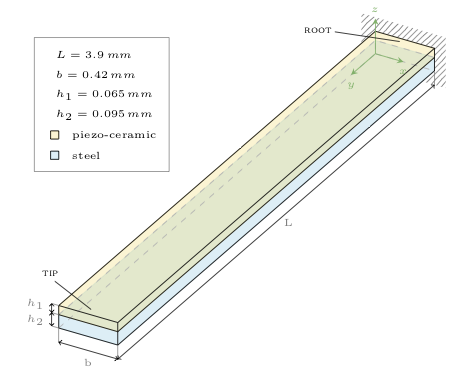
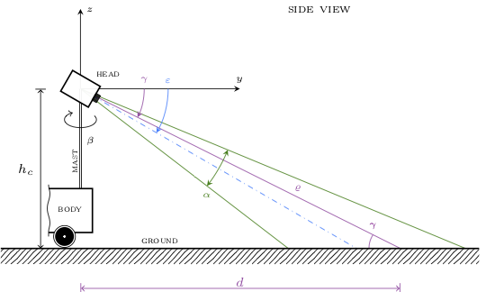
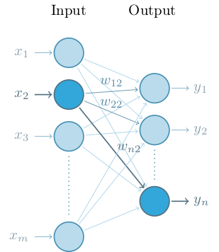
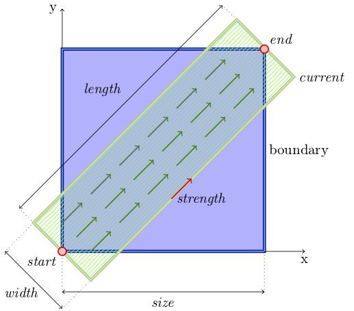
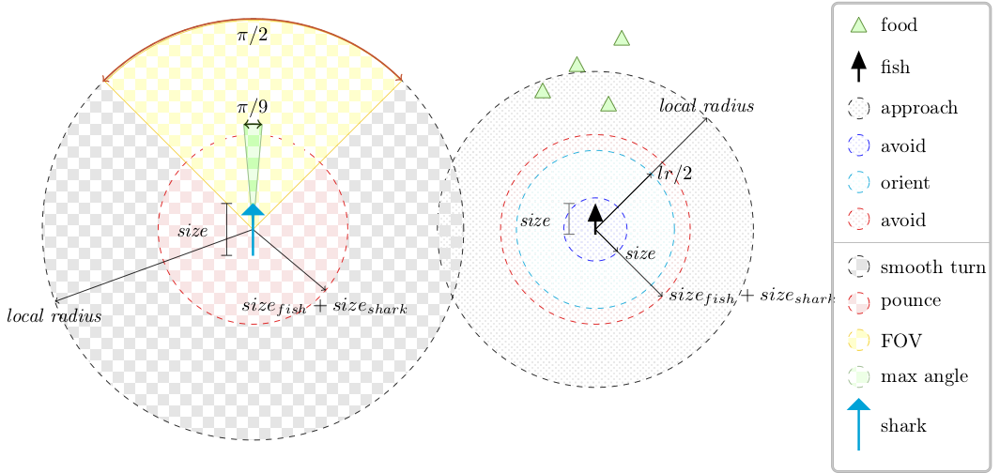

# tikz_drawings

This is a collection of drawings made with [TikZ](https://www.ctan.org/pkg/pgf?lang=en) package in *LaTeX*.

- `main.tex` embeds *LaTeX* code to generate the drawings, just comment out the required drawing
- `compile.sh` contains the bash script to compile the main.tex file
- [`3dplot.sty`](https://www.ctan.org/tex-archive/graphics/pgf/contrib/tikz-3dplot?lang=en) is a library needed to compile cantilever.tex
- drawing codes are stored in `/drawings` folder

## Gallery

[`cantilever`](drawings/cantilever.tex)

[`curiosity_mastcam`](drawings/curiosity_mastcam.tex)

[`neural_net`](drawings/neural_net.tex)

[`ocean`](drawings/ocean.tex)

[`sarsa`](drawings/sarsa.tex)

[`shark`](drawings/shark.tex)
